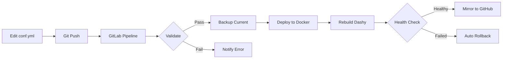

# GitLab CE Deployment

## Overview
Self-hosted GitLab Community Edition with:
- Git repository management
- CI/CD pipelines
- Container registry
- Keycloak SSO integration
- GitHub mirroring for backup
- Automated deployments

## Architecture
```
GitLab CE → Traefik (HTTPS) → https://gitlab.ai-servicers.com
    ↓
Keycloak SSO ← Users
    ↓
GitLab Runner → Docker → Deploy to Infrastructure
    ↓
GitHub Mirror (backup)
```

## Key Features Configured

### 1. Repository Management
- Full Git hosting
- Merge requests & code review
- Branch protection
- Issue tracking
- Wiki documentation

### 2. CI/CD Pipelines
- Automated testing
- Configuration validation
- Auto-deployment on push
- Rollback on failure
- Docker-in-Docker support

### 3. GitHub Mirroring
- Automatic push to GitHub
- Backup of all repositories
- Maintains full history
- Can be scheduled or manual

### 4. Keycloak SSO ✅ FIXED (2025-11-07)
- Single sign-on with existing accounts
- Auto-provision users on first login
- Group claims received from Keycloak
- Hybrid endpoint configuration:
  - Browser endpoints: HTTPS (keycloak.ai-servicers.com:443)
  - Backend endpoints: HTTP (keycloak:8080 via keycloak-net)
- **Status**: ✅ Working correctly
- **Fix Details**: See `/home/administrator/projects/gitlab/keycloak-sso-fix.md`

## Deployment Workflow Example (Dashy)



## Access URLs
- **GitLab**: https://gitlab.ai-servicers.com
- **Container Registry**: https://registry.gitlab.ai-servicers.com
- **SSH Git**: ssh://git@gitlab.ai-servicers.com:2222

## Deployment Scripts

### Initial Deployment
```bash
cd /home/administrator/projects/gitlab
./deploy.sh  # Sources secrets from $HOME/projects/secrets/gitlab.env
```

### Available Scripts
- `deploy.sh` - Main deployment (reads config, deploys container, sets up networks)
- `setup-keycloak.sh` - Configure Keycloak SSO client (requires Keycloak admin password)
- `setup-runner.sh` - Register GitLab Runner for CI/CD
- `import-dashy.sh` - Import Dashy project with CI/CD pipeline

### Check GitLab Status
```bash
docker ps | grep gitlab
docker logs gitlab --tail 50
```

### Backup GitLab
```bash
docker exec -t gitlab gitlab-backup create
```

### Restore GitLab
```bash
docker exec -it gitlab gitlab-backup restore BACKUP=[backup_name]
```

## GitLab + Claude Code Workflow

### How Claude Code Benefits:
1. **Direct Git Operations**: I can commit changes directly to GitLab
2. **Pipeline Creation**: I write `.gitlab-ci.yml` for your projects
3. **Automated Testing**: Changes I make are validated before deployment
4. **Safe Rollbacks**: If my changes break something, auto-rollback
5. **Documentation**: Auto-generate docs from our sessions
6. **Version Control**: Track all changes we make together

### Example Workflow:
```yaml
Claude Code writes code → 
Commits to GitLab → 
Pipeline validates → 
Deploys to staging → 
Tests pass → 
Auto-deploy to production → 
Mirror to GitHub for backup
```

## Network Configuration ✅ FIXED (2025-11-07)
GitLab requires special network setup for Keycloak SSO:
- **Networks**: gitlab-net (192.168.32.2), traefik-net (172.25.0.13), keycloak-net (172.19.0.2)
- **Keycloak Access**:
  - Direct connection via keycloak-net for backend token validation
  - Hostname "keycloak" resolves to 172.19.0.2
- **Hybrid URL Strategy** (CRITICAL for SSO):
  - Browser endpoints use HTTPS: `https://keycloak.ai-servicers.com/realms/master/.../auth`
  - Backend endpoints use HTTP: `http://keycloak:8080/realms/master/.../token`
  - `discovery: false` in gitlab.rb (required for hybrid config)
- **Previous Issue**: Had wrong Keycloak IP (172.22.0.3 → corrected to 172.25.0.11)

## Troubleshooting

### Critical: Permission Issues (502 Errors)
**IMPORTANT**: GitLab Docker uses internal users with specific UIDs that must own the files:
- `git` (UID 998) - Rails, Puma, Workhorse
- `gitlab-psql` (UID 996) - PostgreSQL 
- `gitlab-redis` (UID 997) - Redis
- `gitlab-www` (UID 999) - Nginx

**If GitLab returns 502 or services fail to start:**
```bash
# Use GitLab's built-in permission fix (ALWAYS try this first!)
docker exec gitlab update-permissions
docker restart gitlab

# Wait for services to start (takes 1-2 minutes)
sleep 60
docker exec gitlab gitlab-ctl status
```

**Common symptoms of permission issues:**
- HTTP 502 errors after ~1 minute of usage
- Puma workers fail to start (only 1 instead of 12)
- "Permission denied @ rb_sysopen" errors in logs
- "dial unix .../gitlab.socket: connection refused" 
- Redis socket connection errors

**DO NOT manually change permissions** - even chmod 777 won't fix Ruby permission checks that also verify ownership.

### GitLab Won't Start
```bash
# Check logs
docker logs gitlab --tail 100

# If permission errors, use update-permissions
docker exec gitlab update-permissions
docker restart gitlab

# Reconfigure
docker exec -it gitlab gitlab-ctl reconfigure
```

### Runner Can't Connect
```bash
# Check runner status
docker exec -it gitlab-runner gitlab-runner status

# Re-register runner
docker exec -it gitlab-runner gitlab-runner register
```

### SSO Not Working
```bash
# Verify host entry exists
docker exec gitlab cat /etc/hosts | grep keycloak

# Test Keycloak connectivity from GitLab
docker exec gitlab curl -s http://keycloak.ai-servicers.com:8080/realms/master/.well-known/openid-configuration

# Check OAuth configuration
docker exec -it gitlab gitlab-rails console
> Gitlab::OAuth::Provider.providers
```

## Configuration & Secrets

### Environment Variables
Stored in `$HOME/projects/secrets/gitlab.env`:
- `GITLAB_ROOT_PASSWORD`: Root user password (complex, no common words)
- `GITLAB_OIDC_CLIENT_SECRET`: Keycloak client secret (auto-generated)
- `GITLAB_SMTP_PASSWORD`: SendGrid API key for email
- All other GitLab settings and feature flags

### Data & Configuration Files
All GitLab data stored in `/home/administrator/data/gitlab/`:
- `config/` - GitLab configuration, SSL certificates, SSH keys
- `logs/` - Application logs
- `data/` - GitLab data, repositories, uploads
- Contains sensitive files like `gitlab-secrets.json` and SSH host keys

## Backup Strategy
- Daily automated backups via cron
- Stored in `/home/administrator/projects/backups/gitlab`
- Mirrored to GitHub for offsite backup
- 7-day retention policy

## Security Notes
- SSH on port 2222 (not default 22)
- Keycloak SSO for authentication
- Container registry requires authentication
- Private repositories by default
- Signed commits supported

## Known Issues

### File Ownership Problem
GitLab's Docker container runs as root internally and creates files owned by root in `/home/administrator/data/gitlab`. This is a security concern as files in user home directories should not be owned by root.

**To fix ownership:**
```bash
sudo /home/administrator/projects/gitlab/fix-permissions.sh
```

**Long-term solutions to consider:**
1. Use user namespace mapping in Docker
2. Run container with `--user` flag (may break GitLab)
3. Use a different GitLab image that supports non-root operation
4. Mount volumes with specific UID/GID options

---
*Deployed: 2025-08-26*
*Purpose: Central Git repository and CI/CD platform*